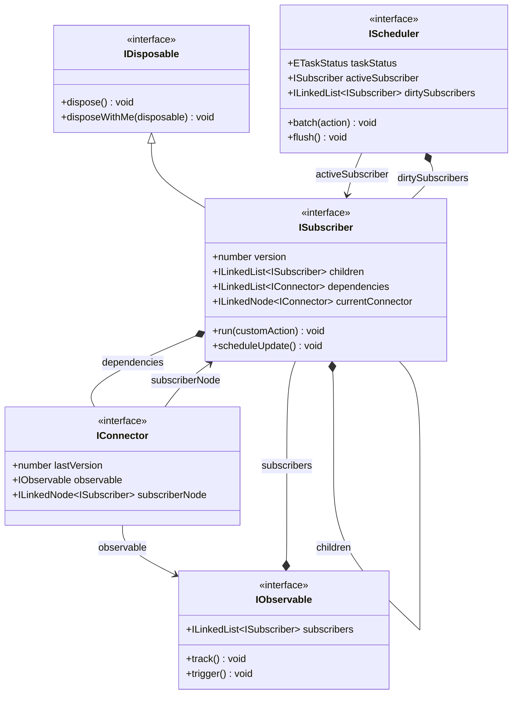

# @lenic/signal

TypeScriptで構築された、軽量・堅牢・超高性能かつ型安全な Signals リアクティブ状態管理エンジン。

[](https://www.npmjs.com/package/@lenic/signal)
[](https://github.com/Lenic/signal-engine/blob/main/LICENSE)
[](https://www.npmjs.com/package/@lenic/signal)

---

🌐 **Languages / 多言語**:

- **[English (英語)](./README.md)**
- **[简体中文 (中国語)](./README.zh-CN.md)**

---

## 🌟 はじめに

`@lenic/signal` は、Signals パターンの純粋な TypeScript 実装です。依存関係を動的かつ詳細に追跡し、観測可能な値（Observable）が変更されたときに自動的に副作用（Side Effect）をトリガーすることで、きめ細かな状態管理を提供します。

一般的な肥大化したリアクティブフレームワークとは異なり、`@lenic/signal` は**確定的な同期スケジューリング**と**厳密なメモリ管理**に焦点を当てています。フロントエンドフレームワークへの組み込み、ユーティリティライブラリ、またはピュアなバニラ JS/TS アプリケーションに最適です。

### 主要なアーキテクチャのハイライト

- 🚀 **双方向連結リストによる依存関係グラフ (Doubly Linked List)**: サブスクライバーの管理に一般的な配列ではなく、カスタムの**双方向連結リスト**（`LinkedList` と `LinkedNode`）を採用しています。これにより、依存関係が動的に変更されたり、古いサブスクリプションを削除したりする操作が **$O(1)$ の時間複雑度**で実行され、配列の再メモリ割り当てや `splice` によるインデックス再計算のオーバーヘッドを完全に回避します。
- 🔄 **予測可能な同期バッチング (Synchronous Batching)**: `batch()` 内での複数のシグナル書き込みをまとめ、非同期のマイクロタスク（Microtask）を待つことなく、バッチブロックの終了時に `try-finally` を通じて**即座に同期的に** `flush()` を実行します。これにより、極めて予測しやすい動的更新を実現し、非同期処理に伴うデバッグの難しさを解消します。
- 🧹 **階層的な自動クリーンアップ管理 (メモリリークの防止)**: 堅牢なツリー型クリーンアップシステムを実装しています。アクティブなスコープ（ネストされた `effect` や計算値 `memo`）の内部で作成された子サブスクライバーは、親サブスクライバーの配下に自動的に登録されます。親が再実行されるか破棄（`dispose`）されると、すべての子サブスクリプションが**再帰的かつクリーンに自動破棄**され、メモリリークを根底から防止します。

---

## 📐 アーキテクチャとフロー

`@lenic/signal` のリアクティブフローは、主に次の4つの抽象化に依存しています：

1.  **Observable（可観測源）**: 追跡可能な値やアクションを保持します（例: `Signal` または `Memo`）。
2.  **Subscriber（購読者）**: リアクティブ論理の実行環境です（例: `Effect` の実行環境や `Memo` の評価器）。
3.  **Connector（コネクター `IConnector`）**: 双方向連結リストブリッジであり、Observable と Subscriber の間に $O(1)$ の動的接続を確立します。
4.  **Scheduler（スケジューラー）**: 同期バッチングと更新キューの実行を制御します。



---

## 📦 インストール

お好みのパッケージマネージャーを使用してインストールしてください：

```bash
# npm の場合
npm install @lenic/signal

# pnpm の場合
pnpm add @lenic/signal

# yarn の場合
yarn add @lenic/signal
```

---

## 🛠️ API リファレンスとコード例

### 1. `signal(initialValue)`

値を保持する読み書き可能な Signal を作成します。

- **値の読み取り**: 作成した関数をそのまま呼び出します: `count()`
- **値の書き込み**: `.set(newValue)` メソッドを使用します: `count.set(newValue)`

```typescript
import { signal } from '@lenic/signal';

const count = signal(0);

// 値の読み取り
console.log(count()); // 出力: 0

// 値の書き込み
count.set(5);
console.log(count()); // 出力: 5
```

### 2. `effect(fn)`

サブスクライバーを作成し、即座に `fn` を実行して、アクセスされた Signal の依存関係を自動的に収集します。依存値が変更されるたびに、`fn` が自動的に再実行されます。

- **戻り値**: 副作用の購読を解除し、リソースをクリーンアップする関数 `() => void`。

```typescript
import { signal, effect } from '@lenic/signal';

const count = signal(0);
const name = signal('山田');

// 即座に "山田 のカウントは: 0" と出力されます
const dispose = effect(() => {
  console.log(`${name()} のカウントは: ${count()}`);
});

count.set(1); // 出力: "山田 のカウントは: 1"
name.set('佐藤'); // 出力: "佐藤 のカウントは: 1"

// 変更の追跡と自動反応を停止します
dispose();

count.set(2); // (何も出力されません)
```

### 3. `memo(fn)`

遅延評価 (Lazy Evaluation) と結果のキャッシュ (Memoization) を行う読み取り専用の計算 Signal を作成します。

- **遅延評価とキャッシュ**: 依存関係が変更され、**かつ**値が実際に読み取られたときにのみ再計算されます。
- **戻り値**: `.dispose()` と `.disposeWithMe(disposable)` を含む読み取り専用の計算 Signal。

```typescript
import { signal, memo } from '@lenic/signal';

const count = signal(10);
const double = memo(() => {
  console.log('計算中...'); // 依存関係が変更され、読み取られた時のみ実行
  return count() * 2;
});

// 初回読み取り - 計算をトリガー
console.log(double()); // 出力: "計算中..." -> 20

// 2回目の読み取り - 再計算せずキャッシュされた値を返す
console.log(double()); // 出力: 20

// 依存シグナルの変更
count.set(20);

// 値が dirty（ダーティ）としてマークされ、次の読み取り時に再計算されます
console.log(double()); // 出力: "計算中..." -> 40

// サブスクリプションを破棄し、メモリを解放します
double.dispose();
```

### 4. `batch(action)`

複数の Signal 変更アクションを1つのブロック内にまとめ、ブロックの完了後に副作用を同期的に1回だけトリガーすることで、重複計算を防ぎます。

- **実行メカニズム**: 純粋な同期処理。`batch` 内のアクションが完了した直後、`finally` ブロックで同期的に `flush()` が呼び出されます。

```typescript
import { signal, effect, batch } from '@lenic/signal';

const count = signal(0);
const name = signal('A');

effect(() => {
  console.log(`更新: ${name()} - ${count()}`);
}); // 出力: "更新: A - 0"

// batch を使用して複数の更新を統合
batch(() => {
  name.set('B'); // まだエフェクトは実行されません
  count.set(100); // まだエフェクトは実行されません
});

// 出力: "更新: B - 100" (バッチ終了時に同期的に1回だけ実行されます)
```

---

## 🧹 厳密なメモリ管理とネストされた自動廃棄

`@lenic/signal` は、ツリー構造の堅牢なスコープ廃棄機能を備えており、ネストされたリアクティブ構造を安全に管理できます。

`Subscriber`（`effect` または `memo`）が別の親 `Subscriber` の実行コンテキスト内で作成された場合、その子サブスクライバーは親の配下に自動的に子ノードとして登録されます。親が再実行されるか、`.dispose()` によって破棄されると、配下のすべての子サブスクライバーも**再帰的に自動破棄**されます。

```typescript
import { signal, effect } from '@lenic/signal';

const outerSignal = signal(0);
const innerSignal = signal(100);

const disposeOuter = effect(() => {
  console.log(`親 Signal: ${outerSignal()}`);

  // ネストされた Effect: 自動的に親 'outer' 購読者の子として登録されます
  effect(() => {
    console.log(`子 Signal: ${innerSignal()}`);
  });
});
// 初回出力:
// "親 Signal: 0"
// "子 Signal: 100"

innerSignal.set(200); // 出力: "子 Signal: 200"

// 親のエフェクトを破棄すると、内部の子エフェクトも自動的にクリーンアップされます
disposeOuter();

innerSignal.set(300); // (出力なし。子エフェクトは親とともに安全に破棄され、メモリリークはありません)
```

---

## 📄 ライセンス

このプロジェクトは [MIT ライセンス](file:///Users/leniclei/test-code/signal-engine/LICENSE) のもとでオープンソースとして公開されています。
