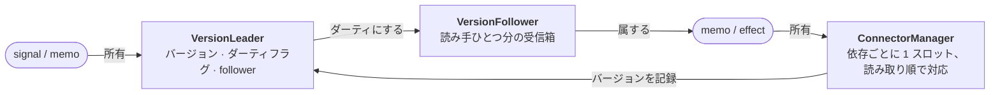
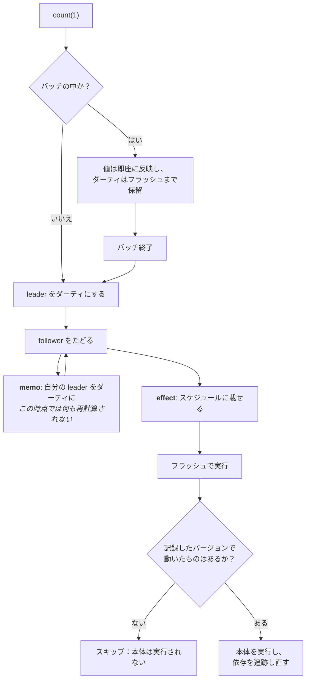

# @lenic/signal

TypeScript向けの、小さくて同期的なシグナルエンジン。値は自分を読んでいる相手を知っていて、下流は放っておいても整合性を保ちます。配線は一本も要りません。

[](https://www.npmjs.com/package/@lenic/signal)
[](https://github.com/lenic/signal-engine/blob/main/LICENSE)
[](https://www.npmjs.com/package/@lenic/signal)

🌐 **[English](./README.md)** · **[简体中文](./README.zh-CN.md)**

> もともとは面接で自分の実力を見せるための個人的な練習プロジェクトでしたが、そのまま書き足していって、必要な機能はひと通り揃いました。

---

```typescript
import { signal, memo, effect } from '@lenic/signal';

const first = signal('Ada');
const last = signal('Lovelace');

const fullName = memo(() => `${first()} ${last()}`);

effect(() => console.log(fullName()));
// → "Ada Lovelace"

last('Byron');
// → "Ada Byron"
```

購読の登録も、依存配列の管理も、後片付けも要りません。`memo` や `effect` の中で値を読むこと自体が購読で、あとはエンジンが引き受けます。

---

## これを選ぶ理由

**公開されている適合性テストスイートを、一件も落とさずに通します。**
[`reactive-framework-test-suite`](https://www.npmjs.com/package/reactive-framework-test-suite)
には 179 件のケースがあり、グリッチのない伝播、動的依存、バッチ処理、破棄順序、循環検出、エラー復帰までを扱います。リアクティブエンジンの違いがいちばん出るのに、どこにも書かれていない部分です。ここでは **179 / 179 をスキップなしで通過**し、さらに独自のテストが 90 件あります。`pnpm test` を走らせれば確認できます。

**すべてが同期的です。** 書き込みは次の行が実行される前に確定します。マイクロタスクキューもなく、「1 tick待てば整合する」もありません。そのぶんテストしやすく、問題が起きたときも追いやすいです。

**所有者より長く生き残るものはありません。** `memo` や `effect` の実行中に作られたものは、ネストしたeffectでも、クリーンアップ関数でも、引き受けたリソースでも、すべてその実行に属します。所有者が再実行されるか破棄されれば、まとめて再帰的に消えます。

**速度をごまかしません。** 伝播は他と張り合えますが、生成はまだです。負けている数字も含めて、すべて[下に](#パフォーマンス)あります。

---

## インストール

```bash
npm install @lenic/signal
pnpm add @lenic/signal
yarn add @lenic/signal
```

---

## API

関数は 4 つ。これで全部です。

### `signal(initialValue, options?)`

読み書きできる値です。引数なしで呼べば読み取り、1 つ渡せば書き込みです。

```typescript
const count = signal(0);

count();      // → 0     （読み取り）
count(5);     // （書き込み）
count();      // → 5
```

現在の値と等しい値を書いても何も変わらず、誰にも通知されません。既定の判定は `===` で、厳しすぎるときは自前の比較関数を渡せます：

```typescript
const deepEqual = (a: unknown, b: unknown) => JSON.stringify(a) === JSON.stringify(b);
const config = signal({ theme: 'dark' }, { comparer: deepEqual });

config({ theme: 'dark' });   // 新しいオブジェクトだが、下流は一つも再実行されない
config({ theme: 'light' });  // こちらは伝播する
```

### `memo(fn)`

導出値です。誰かが読むまで実行されず、一度実行したら依存が実際に変わるまでキャッシュされます。

```typescript
const items = signal([1, 2, 3]);

const total = memo(() => {
  console.log('summing');
  return items().reduce((a, b) => a + b, 0);
});

total();  // → 6、"summing" を出力
total();  // → 6、出力なし — キャッシュ

items([1, 2, 3, 4]);
total();  // → 10、"summing" を出力
```

再計算した値が変わらなければ、伝播はそこで止まります。上流がいくら動いても結果に影響しないなら、下流のコストはゼロです：

```typescript
const n = signal(1);
const isOdd = memo(() => n() % 2 === 1);

effect(() => console.log(isOdd()));  // → true

n(3);  // n は変わり isOdd も再計算されたが、結果は true のまま → effect は再実行されない
```

どこにも所有されていないmemoは、使い終わったら `total.dispose()` を呼んでください。

### `effect(fn)`

`fn` をすぐに実行し、読み取ったものを追跡して、それが変わるたびに再実行します。返ってくる関数で停止できます。

```typescript
const user = signal('ada');

const stop = effect(() => {
  document.title = user();
});

user('grace');   // タイトルが更新される
stop();
user('katherine');  // 何も起きない
```

**初回実行は常に同期的です。** 生成時でも、バッチの中でも、別のeffectの中でも同じです。`effect()` が返る時点で本体は実行済みで、依存も有効になっています。

**関数を返せば後片付けができます。** 次の再実行の直前に走り、effectが破棄されるときにもう一度走ります：

```typescript
const channel = signal('general');

effect(() => {
  const socket = connect(channel());

  return () => socket.close();
});
```

### `batch(fn)`

複数の書き込みをまとめ、下流には途中経過ではなく確定した結果だけを見せます。

```typescript
const width = signal(10);
const height = signal(20);

effect(() => console.log(width() * height()));  // → 200

batch(() => {
  width(30);
  height(40);
});
// → 1200 が 1 回だけ — 600 のあとに 1200、ではない
```

バッチ処理も同期的です。フラッシュは `batch()` が返る時点で起こり、後のtickに回されることはありません。書き込みが打ち消し合った場合（別の値にしてから戻した場合）は、下流は一度も実行されません。

---

## ライフサイクル

`memo` や `effect` の実行中に作られたものは、すべてその実行に所有されます。

```typescript
const outer = signal(0);
const inner = signal(0);

const stop = effect(() => {
  outer();

  effect(() => console.log('inner:', inner()));
});

inner(1);   // → "inner: 1"

stop();     // ネストした effect も一緒に消える
inner(2);   // 何も起きない
```

所有者が単に再実行される場合も同じです。前回の実行の子は、新しい実行が代わりを作る前に破棄されます。溜まっていくことはありません。

---

## しくみ

流れは 2 方向あり、どの部品もそのどちらか一方のために存在します。



右向き：読み手は自分が読んだものの**バージョン**を記録します。
左向き：変化した供給側は自分のfollowerを**ダーティ**にします。

ダーティの意味は「確認しに来い」であって「再計算しろ」ではありません。読み手は目を覚まし、記録したバージョンと現在のバージョンを突き合わせ、実際に動いたものがあるときだけ本体を実行します。結果が変わらなければ伝播がそこで止まるのは、このためです。

書き込み 1 回の全体像：



### 構成要素

| | |
| --- | --- |
| `EqualComparer` | 値を保持し、何をもって「変化」とするかを決める |
| `VersionLeader` | 読み取り可能な供給側：バージョン、ダーティフラグ、followerの一覧 |
| `VersionFollower` | 読み手ひとつ分のダーティ受信箱 |
| `ConnectorManager` | 読み手の依存スロット。読み取り順で対応するため、依存構成が安定していれば 1 回の読み取りにつき同一性チェック 1 回で済む |
| `Schedulable` | signalに保留中の書き込みがあるか、effectに保留中の実行があるか |
| `globalScheduler` | バッチを開き、キューを排出し、暴走した循環がプロセス全体を汚染するのを防ぐ |

依存は**位置**で追跡されます。読み手のスロットは読み取り順に埋まるので、形の変わらないグラフはそれらをその場で再利用します。確保も帳簿付けも要りません。形が変わったときは食い違うスロットだけを繋ぎ直し、同じ供給側を 2 回読んだ場合は 1 回目が確保したスロットに畳み込まれます。

---

## パフォーマンス

同じグラフ形状で、成熟した 3 つのリアクティブコアと比較しています。自分でも実行できます：

```bash
pnpm bench
```

Node v25.8.2、各セル 15 サンプルの中央値を 3 回分取り、その中央値。単位はミリ秒。**小さいほど良い。**

| シナリオ | **@lenic/signal** | @preact/signals-core | alien-signals | @vue/reactivity |
| --- | --- | --- | --- | --- |
| 深いチェーン（深さ 50、5k回書き込み） | 25.0 | 11.2 | **4.8** | 14.4 |
| ファンアウト（1 供給源、100 memo） | 18.2 | 8.2 | **4.0** | 10.7 |
| ダイヤモンド（幅 20、5k回書き込み） | 11.4 | 9.0 | **4.3** | 11.2 |
| 動的依存（1 万回の分岐切り替え） | 5.3 | 2.4 | **1.6** | 3.6 |
| 広い依存（100 signal、1 万回書き込み） | 18.6 | 12.9 | **11.0** | 16.3 |
| キャッシュ読み取り（100 万回） | **5.3** | 5.8 | 5.6 | 8.5 |
| 生成（signal+memo 2 万組） | 12.8 | 1.5 | **1.1** | 2.1 |
| effect生成+破棄（2 万回） | 9.1 | 1.5 | **0.8** | 2.0 |
| バッチ書き込み（2000 バッチ × 10） | 5.0 | 1.2 | **0.8** | n/a |

**現在の位置。** 変化していないmemoの繰り返し読み取りは 4 つの中で最速です。広い依存構成での伝播は 1.7 倍以内、ダイヤモンドは 2.7 倍、動的依存の切り替えは 3.3 倍、深いチェーンとファンアウトは 5 倍前後です。弱点は生成で、およそ 12 倍。ここではsignal 1 つが 472 バイト、他のライブラリでは 88〜160 バイトです。値、バージョン管理、スケジューリングが 1 つのオブジェクトのフィールドではなく、3 つの独立した協力者になっているからです。

この分割は意図的なもので、適合性テストを通せた理由でもあります。このエンジンで見つかった十数件の表に出ないバグは、これらの役割を個別に観測することで特定できました。生成コストの残りの差を埋めるにはそれらを統合することになりますが、その計算はどうしても合いません。生成はsignalごとに 1 回きり、伝播はずっと続きます。

**注意点。** これらはアイドル状態のマシン上の合成グラフです。順位はグラフの形、更新頻度、ペイロードのサイズで変わりますし、数値は同一マシンの同一実行内でしか比較できません。`pnpm bench` は計測の前にすべてのライブラリが同じ挙動をすることを検証し、シナリオごとにチェックサムを突き合わせます。これがなければ、こっそり手を抜いたライブラリが最速に見えてしまいます。個々のセルは実行ごとに 3 分の 1 ほど振れます（特にダイヤモンド、バッチ書き込み、effect生成+破棄）。上の表を 1 回の実行ではなく 3 回分の中央値にしているのはそのためです。

---

## ステータス

まだ `0.x` で、内部実装はマイナーバージョン間で動きます。公開されている 4 つの関数は安定しています。エクスポートされている機構（`VersionLeader`、`ConnectorManager`、`globalScheduler` など）はその上に何かを組み立てるためのもので、こちらは変わります。

---

## ライセンス

[MIT](./LICENSE)
