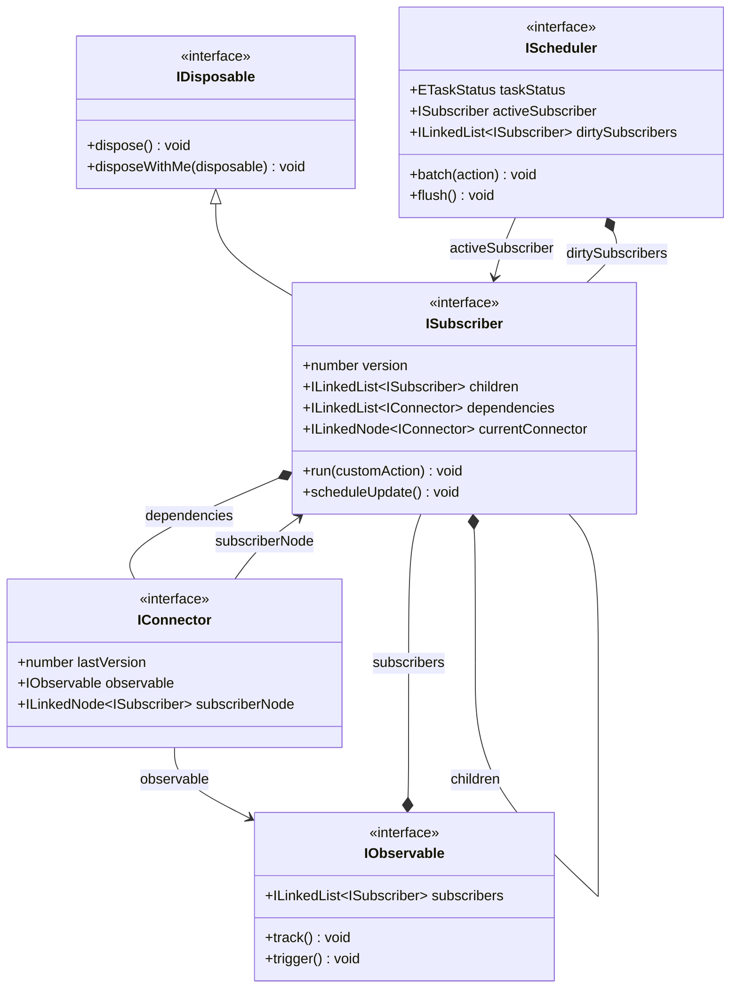

# @lenic/signal

A lightweight, robust, high-performance, and type-safe Signals reactive engine built with TypeScript.

[](https://www.npmjs.com/package/@lenic/signal)
[](https://github.com/leniclei/signal-engine/blob/main/LICENSE)
[](https://www.npmjs.com/package/@lenic/signal)

---

🌐 **Languages / 多语言**:

- **[简体中文 (Simplified Chinese)](./README.zh-CN.md)**
- **[日本語 (Japanese)](./README.ja.md)**

---

## 🌟 Introduction

`@lenic/signal` is a pure TypeScript implementation of the Signals pattern. It provides fine-grained, reactive state management by tracking dependencies dynamically and triggering side effects automatically when observable values change.

Unlike traditional reactive frameworks, `@lenic/signal` focuses on predictable sync scheduling and meticulous memory management. It is designed to be embedded in frontend frameworks, utility libraries, or pure vanilla JS applications.

### Key Architectural Highlights

- 🚀 **Doubly Linked List Dependency Graph**: Utilizes custom doubly linked lists (`LinkedList` and `LinkedNode`) instead of standard arrays to store connections. Dynamic dependency changes and stale subscription cleanup operate in $O(1)$ time complexity, bypassing array reallocation and splice overhead.
- 🔄 **Predictable Synchronous Batching**: Bundles multiple signal writes inside a `batch()` call, executing updates synchronously at the end of the batch block without waiting for an asynchronous microtask cycle.
- 🧹 **Hierarchical Lifecycle Management (No Memory Leaks)**: Implements structured disposal. Subscriptions created within active scopes (such as nested effects or computed memos) are registered under their parent scope and are **automatically and recursively cleaned up** when the parent is disposed.

---

## 📐 Architecture & Flow

The reactive flow of `@lenic/signal` relies on four main abstractions:

1.  **Observable**: Holds values/actions that can be tracked (e.g., `Signal` or `Memo`).
2.  **Subscriber**: Executing environment for reactive logic (e.g., `Effect` or `Memo` runner).
3.  **Connector (`IConnector`)**: A doubly-linked bridge establishing an $O(1)$ relationship between Observables and Subscribers.
4.  **Scheduler**: Manages queue execution and enforces synchronous batching.



---

## 📦 Installation

Install the package via your favorite package manager:

```bash
# Using npm
npm install @lenic/signal

# Using pnpm
pnpm add @lenic/signal

# Using yarn
yarn add @lenic/signal
```

---

## 🛠️ API Reference & Examples

### 1. `signal(initialValue)`

Creates a writable signal that holds a value.

- **Read**: Call the function itself: `val()`
- **Write**: Use the `.set(value)` method: `val.set(newValue)`

```typescript
import { signal } from '@lenic/signal';

const count = signal(0);

// Reading the signal
console.log(count()); // Output: 0

// Modifying the signal
count.set(5);
console.log(count()); // Output: 5
```

### 2. `effect(fn)`

Creates a subscriber that immediately executes `fn`, automatically tracks accessed signals, and reruns whenever those signals change.

- **Returns**: A cleanup function `() => void` to dispose of the effect.

```typescript
import { signal, effect } from '@lenic/signal';

const count = signal(0);
const name = signal('Antigravity');

// Immediately prints "Antigravity has count: 0"
const dispose = effect(() => {
  console.log(`${name()} has count: ${count()}`);
});

count.set(1); // Output: "Antigravity has count: 1"
name.set('DeepMind'); // Output: "DeepMind has count: 1"

// Stop tracking changes
dispose();

count.set(2); // (No output)
```

### 3. `memo(fn)`

Creates a read-only computed signal that lazily evaluates and memoizes the result of the provided function.

- **Lazy & Cached**: Only recomputes if its dependencies have changed **and** the value is actually read.
- **Returns**: A readonly signal containing `.dispose()` and `.disposeWithMe(disposable)`.

```typescript
import { signal, memo } from '@lenic/signal';

const count = signal(10);
const double = memo(() => {
  console.log('Calculating...'); // Only runs when dependencies change and read
  return count() * 2;
});

// First read - triggers computation
console.log(double()); // Output: "Calculating..." -> 20

// Subsequent read - returns cached value without recomputing
console.log(double()); // Output: 20

// Modify dependency
count.set(20);

// Value is dirty now, next read computes again
console.log(double()); // Output: "Calculating..." -> 40

// Cleanup memo subscriber
double.dispose();
```

### 4. `batch(action)`

Combines multiple signal mutations inside one block, delaying the execution of subscriber side effects until the block completes.

- **Execution**: Purely synchronous. The `flush()` runs immediately after the action completes inside a `finally` block.

```typescript
import { signal, effect, batch } from '@lenic/signal';

const count = signal(0);
const name = signal('A');

effect(() => {
  console.log(`Updated: ${name()} - ${count()}`);
}); // Output: "Updated: A - 0"

// Combine multiple updates using batch
batch(() => {
  name.set('B'); // No effect execution yet
  count.set(100); // No effect execution yet
});

// Output: "Updated: B - 100" (Executed once synchronously at the end of batch)
```

---

## 🧹 Memory Management & Parent-Child Disposables

`@lenic/signal` features a robust tree-like cleanup system. Subscriptions are designed to be nested, making it straightforward to build complex hierarchical scopes.

If a `Subscriber` (like an `effect` or `memo`) is created inside the execution of another parent `Subscriber`, the child subscriber automatically registers under the parent. When the parent's `run()` is triggered or when it is `.dispose()`-d, the child subscribers are recursively disposed of.

```typescript
import { signal, effect } from '@lenic/signal';

const outerSignal = signal(0);
const innerSignal = signal(100);

const disposeOuter = effect(() => {
  console.log(`Outer: ${outerSignal()}`);

  // Nested effect: Automatically registered to parent 'outer' subscriber
  effect(() => {
    console.log(`Inner: ${innerSignal()}`);
  });
});
// Initial output:
// "Outer: 0"
// "Inner: 100"

innerSignal.set(200); // Output: "Inner: 200"

// Disposing the outer effect will automatically tear down the nested inner effect
disposeOuter();

innerSignal.set(300); // (No output, inner effect was automatically disposed)
```

---

## 📄 License

This project is licensed under the [MIT License](file:///Users/leniclei/test-code/signal-engine/LICENSE).
