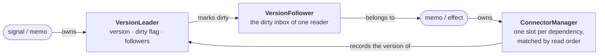
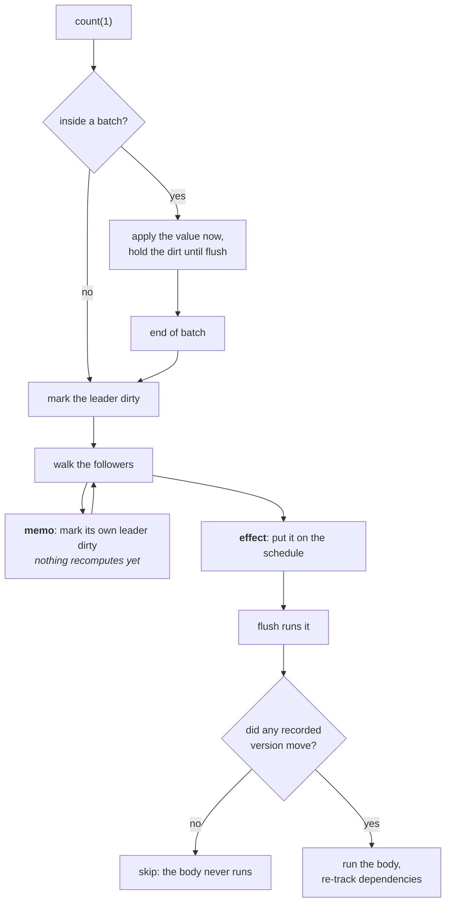

# @lenic/signal

A small, synchronous signals engine for TypeScript. Values know who reads them, and everything
downstream stays correct without you wiring a thing.

[](https://www.npmjs.com/package/@lenic/signal)
[](https://github.com/lenic/signal-engine/blob/main/LICENSE)
[](https://www.npmjs.com/package/@lenic/signal)

🌐 **[简体中文](./README.zh-CN.md)** · **[日本語](./README.ja.md)**

> This started as a personal exercise, something to show what I could build while interviewing, and
> it kept growing until it covered the whole feature set.

---

```typescript
import { signal, memo, effect } from '@lenic/signal';

const first = signal('Ada');
const last = signal('Lovelace');

const fullName = memo(() => `${first()} ${last()}`);

effect(() => console.log(fullName()));
// → "Ada Lovelace"

last('Byron');
// → "Ada Byron"
```

No subscriptions to register, no dependency arrays to keep in sync, no teardown to remember.
Reading a value inside a `memo` or an `effect` is the subscription, and the engine works out the
rest.

---

## Why you might pick this one

**It passes a public conformance suite in full.**
[`reactive-framework-test-suite`](https://www.npmjs.com/package/reactive-framework-test-suite)
is 179 cases covering glitch-freedom, dynamic dependencies, batching, disposal ordering, cycle
detection and error recovery. Those are the corners where reactive engines differ in ways nobody
documents. This one passes **179 / 179 with nothing skipped**, plus 85 tests of its own. Run
`pnpm test` and check.

**Everything is synchronous.** A write settles before the next line of your code runs. No
microtask queue, no "wait a tick and it will be consistent". That makes it easy to test, and easy
to follow when something goes wrong.

**Nothing outlives its owner.** Anything created while a `memo` or `effect` is running belongs to
that run: nested effects, cleanup functions, adopted resources. When the owner re-runs or is
disposed, they all go with it, recursively.

**No spin on the speed.** Propagation is competitive, construction is not yet. The whole table,
losses included, is [further down](#performance).

---

## Install

```bash
npm install @lenic/signal
pnpm add @lenic/signal
yarn add @lenic/signal
```

---

## API

Four functions. That is the whole surface.

### `signal(initialValue, options?)`

A value you can read and write. Call it with no arguments to read, with one to write.

```typescript
const count = signal(0);

count();      // → 0     (read)
count(5);     // (write)
count();      // → 5
```

Writing a value that compares equal to the current one changes nothing and notifies nobody.
Equality is `===` by default; pass your own when that is too strict:

```typescript
const deepEqual = (a: unknown, b: unknown) => JSON.stringify(a) === JSON.stringify(b);
const config = signal({ theme: 'dark' }, { comparer: deepEqual });

config({ theme: 'dark' });   // a new object, but nothing downstream re-runs
config({ theme: 'light' });  // this one propagates
```

### `memo(fn)`

A derived value. It does not run until something reads it, and the result stays cached until one of
its dependencies actually changes.

```typescript
const items = signal([1, 2, 3]);

const total = memo(() => {
  console.log('summing');
  return items().reduce((a, b) => a + b, 0);
});

total();  // → 6, logs "summing"
total();  // → 6, silent — cached

items([1, 2, 3, 4]);
total();  // → 10, logs "summing"
```

A memo stops propagating when its own value comes out unchanged, so a source that churns without
affecting the result costs you nothing downstream:

```typescript
const n = signal(1);
const isOdd = memo(() => n() % 2 === 1);

effect(() => console.log(isOdd()));  // → true

n(3);  // `n` changed, `isOdd` recomputed, still true → the effect does not re-run
```

Call `total.dispose()` when you are done with a memo that is not owned by anything else.

### `effect(fn)`

Runs `fn` immediately, tracks whatever it reads, and runs it again whenever any of that changes.
Returns a function that stops it.

```typescript
const user = signal('ada');

const stop = effect(() => {
  document.title = user();
});

user('grace');   // title updates
stop();
user('katherine');  // nothing happens
```

The first run is always synchronous, whether on creation, inside a batch, or inside another
effect. By the time `effect()` returns, the body has run and its dependencies are live.

**Return a function to clean up after yourself.** It runs before the next re-run, and once more
when the effect is disposed:

```typescript
const channel = signal('general');

effect(() => {
  const socket = connect(channel());

  return () => socket.close();
});
```

### `batch(fn)`

Groups writes so that everything downstream sees one settled result instead of each intermediate
step.

```typescript
const width = signal(10);
const height = signal(20);

effect(() => console.log(width() * height()));  // → 200

batch(() => {
  width(30);
  height(40);
});
// → 1200, once — not 600 then 1200
```

Batching is synchronous too: the flush happens as `batch()` returns, not on a later tick. And if
the writes cancel out (set to something else and back again), nothing downstream runs at all.

---

## Lifecycle

Anything created while a `memo` or `effect` is running is owned by that run.

```typescript
const outer = signal(0);
const inner = signal(0);

const stop = effect(() => {
  outer();

  effect(() => console.log('inner:', inner()));
});

inner(1);   // → "inner: 1"

stop();     // the nested effect goes too
inner(2);   // silence
```

The same holds when the owner merely re-runs: the previous run's children are disposed before the
new run creates its replacements. Nothing accumulates.

---

## How it works

Two directions of traffic, and every piece exists to serve one of them.



Going right: a reader records the **version** of everything it reads.
Going left: a source that changes marks its followers **dirty**.

Dirty means "come and check", not "recompute". The reader wakes up, compares each recorded version
against the current one, and only runs its body if something actually moved. That is what makes an
unchanged result stop propagation dead.

Here is a write, end to end:



### The pieces

| | |
| --- | --- |
| `EqualComparer` | Holds a value and decides what counts as a change |
| `VersionLeader` | A readable source: a version, a dirty flag, and its followers |
| `VersionFollower` | The dirty inbox belonging to one reader |
| `ConnectorManager` | A reader's dependency slots, matched by read order so a stable dependency set costs one identity check per read |
| `Schedulable` | Whether a signal has a pending write, or an effect a pending run |
| `globalScheduler` | Opens batches, drains the queues, and stops a runaway cycle from poisoning the process |

Dependencies are tracked by **position**. A reader's slots are filled in read order, so a graph
whose shape does not change reuses them in place, with no allocation and no bookkeeping. When the
shape does change, only the slots that disagree get rewired, and reading the same source twice
folds into the slot the first read already claimed.

---

## Performance

Measured against three mature reactive cores on the same graphs. Run it yourself:

```bash
pnpm bench
```

Node v25.8.2, 15 samples per cell, median, milliseconds. **Lower is better.**

| Scenario | **@lenic/signal** | @preact/signals-core | alien-signals | @vue/reactivity |
| --- | --- | --- | --- | --- |
| deep chain (depth 50, 5k writes) | 42.2 | 11.2 | **4.8** | 14.4 |
| fan-out (1 source, 100 memos) | 24.4 | 8.4 | **3.9** | 10.7 |
| diamond (width 20, 5k writes) | 23.5 | 8.7 | **3.3** | 11.1 |
| dynamic deps (10k branch switches) | 8.7 | 2.6 | **1.6** | 2.8 |
| wide sources (100 signals, 10k writes) | 20.0 | 12.9 | **10.7** | 16.6 |
| cached reads (1M reads) | **5.3** | 5.8 | 6.4 | 8.4 |
| creation (20k signal+memo pairs) | 12.8 | 1.5 | **1.1** | 2.1 |
| effect create+dispose (20k) | 9.3 | 1.6 | **0.8** | 2.1 |
| batched writes (2k × 10) | 4.3 | 1.2 | **0.8** | n/a |

**Where it stands.** Repeated reads of an unchanged memo are the fastest of the four. Propagation
through a wide dependency set is within 2×. Deep chains and fan-out sit at 6 to 9×. Construction
is the weak spot at roughly 12×: a signal costs 480 bytes here against a few dozen elsewhere,
because value, versioning and scheduling are three separate collaborators rather than fields on
one object.

That split is deliberate, and it is what made the conformance run reachable. Watching those roles
independently is how a dozen silent bugs in this engine turned up. Closing the last of the
construction gap means collapsing them, and that trade has not looked worth it: construction
happens once per signal, propagation happens forever.

**Caveats.** These are synthetic graphs on an idle machine. The ranking moves with graph shape,
update frequency and payload size. Numbers are comparable only within one run on one machine.
`pnpm bench` verifies that every library agrees on behaviour before it times anything, and
compares a checksum per scenario. Without that, a library quietly doing less work would look like
the fastest one here.

---

## Status

`0.x`, and the internals still move between minor versions. The four public functions are stable;
the exported machinery (`VersionLeader`, `ConnectorManager`, `globalScheduler` and friends) is
there for building on top, and does change.

---

## License

[MIT](./LICENSE)
