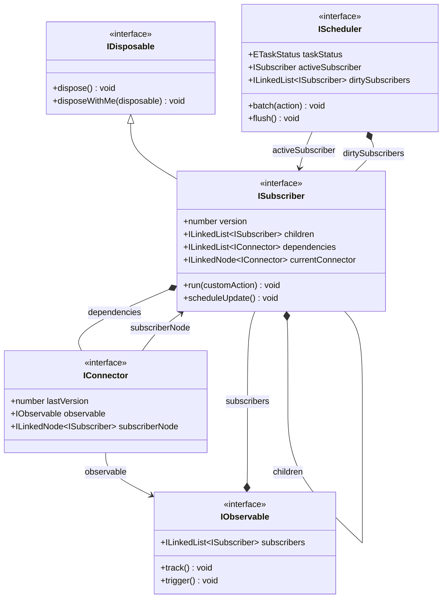

# @lenic/signal

一款轻量、强健、超高性能且类型安全的 TypeScript 响应式 Signals 状态管理引擎。

[](https://www.npmjs.com/package/@lenic/signal)
[](https://github.com/Lenic/signal-engine/blob/main/LICENSE)
[](https://www.npmjs.com/package/@lenic/signal)

---

🌐 **Languages / 多语言**:

- **[English (英文)](./README.md)**
- **[日本語 (日语)](./README.ja.md)**

---

## 🌟 简介

`@lenic/signal` 是 Signals 模式的纯 TypeScript 高效实现。它通过动态且细粒度地追踪依赖关系，在可观察状态发生变化时自动且精准地触发副作用更新。

与许多庞杂的响应式框架不同，`@lenic/signal` 精准地聚焦于**确定性的同步调度**与**极其苛刻的内存管理**。它非常适合被嵌入到前端框架、通用工具库、或者纯原生 JS/TS 应用中。

### 核心技术亮点

- 🚀 **双向链表依赖图 (Doubly Linked List)**：与市面上大多数使用数组存储订阅者的库不同，本项目在底层使用自定义的**双向链表** (`LinkedList` 与 `LinkedNode`) 存储并管理连接器 (`IConnector`)。这使得动态依赖发生改变、释放陈旧订阅关系时的操作达到 **$O(1)$ 时间复杂度**，完全规避了传统数组重新分配内存和 `splice` 移位的性能开销。
- 🔄 **确定性的同步批量更新 (Synchronous Batching)**：提供纯同步的 `batch()` 批量更新调度器。在 `batch` 块执行结束时，通过 `try-finally` 机制**立即同步触发** `flush()` 完成更新，不依赖微任务 (Microtask) 或宏任务 (Macrotask)，从而保持了可预测性极高的同步执行流，避免了异步带来的时序不确定性与调试难度。
- 🧹 **完美的层级生命周期管理 (避免内存泄漏)**：实现了精密的树状自动清理系统。凡是在活跃作用域（例如嵌套的 `effect` 或计算值 `memo`）内创建的子订阅者，都会自动注册在父级订阅者名下。当父级被重新执行或被销毁 (`dispose`) 时，其下的所有子级订阅都会**递归且干净地自动销毁**，从根本上杜绝了闭包引起的内存泄漏。

---

## 📐 架构设计与流程

`@lenic/signal` 的响应式环路主要依赖于以下四个核心抽象：

1.  **Observable (可观察源)**：持有可被追踪的值或动作（如 `Signal` 或 `Memo`）。
2.  **Subscriber (订阅者)**：执行响应式逻辑的容器环境（如 `Effect` 的运行期或 `Memo` 的评估器）。
3.  **Connector (连接器 `IConnector`)**：双向链表构成的桥梁，用于建立并维护 Observable 与 Subscriber 之间 $O(1)$ 的关联关系。
4.  **Scheduler (调度器)**：控制更新队列，实现同步批量更新。



---

## 📦 安装方法

您可以使用您喜爱的包管理器快速安装：

```bash
# 使用 npm
npm install @lenic/signal

# 使用 pnpm
pnpm add @lenic/signal

# 使用 yarn
yarn add @lenic/signal
```

---

## 🛠️ API 参考与代码示例

### 1. `signal(initialValue)`

创建一个持值的可读写 Signal。

- **读取值**：直接调用函数本身：`count()`。
- **更新值**：调用其 `(newValue)` 方法：`count(newValue)`。

```typescript
import { signal } from '@lenic/signal';

const count = signal(0);

// 读取信号值
console.log(count()); // 输出: 0

// 更新信号值
count(5);
console.log(count()); // 输出: 5
```

### 2. `effect(fn)`

创建一个订阅者，立即运行 `fn`，自动收集所访问 Signal 的依赖关系，并在这些依赖项的值变化时自动重新运行。

- **返回值**：一个清理函数 `() => void`，用于销毁该 effect 订阅。

```typescript
import { signal, effect } from '@lenic/signal';

const count = signal(0);
const name = signal('张三');

// 立即输出 "张三 的计数是: 0"
const dispose = effect(() => {
  console.log(`${name()} 的计数是: ${count()}`);
});

count(1); // 输出: "张三 的计数是: 1"
name('李四'); // 输出: "李四 的计数是: 1"

// 停止依赖追踪和自动响应
dispose();

count(2); // (无任何输出)
```

### 3. `memo(fn)`

创建一个只读的计算信号，采用惰性求值 (Lazy Evaluation) 并对结果进行缓存 (Memoization)。

- **惰性与缓存**：只有在其依赖项改变**且**当前值被实际读取时，它才会重新计算。
- **返回值**：一个包含 `.dispose()` 和 `.disposeWithMe(disposable)` 的只读信号。

```typescript
import { signal, memo } from '@lenic/signal';

const count = signal(10);
const double = memo(() => {
  console.log('计算中...'); // 仅在依赖发生变化且被读取时执行一次
  return count() * 2;
});

// 第一次读取 - 触发计算
console.log(double()); // 输出: "计算中..." -> 20

// 连续读取 - 直接返回缓存值，不再重复计算
console.log(double()); // 输出: 20

// 改变依赖项
count(20);

// 值被标记为 dirty（脏），下次读取时会重新计算
console.log(double()); // 输出: "计算中..." -> 40

// 销毁 memo 订阅器，释放资源
double.dispose();
```

### 4. `batch(action)`

用于合并多个 Signal 的修改动作，合并后仅在 block 执行结束时同步触发一次订阅者更新，避免冗余更新带来的性能损耗。

- **运行机制**：完全同步。在 `batch` 中的动作执行完后，立即在 `finally` 块里**同步**调用 `flush`。

```typescript
import { signal, effect, batch } from '@lenic/signal';

const count = signal(0);
const name = signal('A');

effect(() => {
  console.log(`更新结果: ${name()} - ${count()}`);
}); // 输出: "更新结果: A - 0"

// 使用 batch 合并多次更新
batch(() => {
  name('B'); // 暂不触发 effect
  count(100); // 暂不触发 effect
});

// 输出: "更新结果: B - 100" (在 batch 结束时，仅同步执行了一次)
```

---

### 5. `setGlobalDeepComparator(comparator)`

### 5. `setGlobalDeepComparator(comparator)`

`comparator: 'deep'` 选项时使用的全局深比较函数。

```typescript
import { setGlobalDeepComparator, signal } from '@lenic/signal';

// 定义深比较函数（简单的 JSON 字符串比较）
const deepEqual = (a: unknown, b: unknown) => JSON.stringify(a) === JSON.stringify(b);

// 注册全局深比较函数
setGlobalDeepComparator(deepEqual);

// 使用深比较的 Signal
const obj = signal({ count: 1 }, { comparator: 'deep' });

obj({ count: 1 }); // 深度相等，不触发订阅者
obj({ count: 2 }); // 值不同，触发订阅者
```

> **注意**：比较函数必须是纯函数，返回表示深度相等的布尔值。

---

## 🧹 苛刻的内存管理与父子级自动销毁

`@lenic/signal` 内置了健壮的树状作用域销毁设计，使得嵌套的响应式结构开发变得极其安全和省心。

如果一个 `Subscriber`（如 `effect` 或 `memo`）是在另一个父级 `Subscriber` 的执行上下文中创建的，子订阅者会自动挂载并注册为父级订阅者的子节点。一旦父级重新执行（如父级 Effect 重新计算）或父级被 `.dispose()` 销毁时，所有挂载的子级订阅都会**递归自动销毁且彻底释放**。

```typescript
import { signal, effect } from '@lenic/signal';

const outerSignal = signal(0);
const innerSignal = signal(100);

const disposeOuter = effect(() => {
  console.log(`外层 Signal: ${outerSignal()}`);

  // 嵌套 Effect：会自动注册为外层 'outer' 订阅者的子节点
  effect(() => {
    console.log(`内层 Signal: ${innerSignal()}`);
  });
});
// 初始输出：
// "外层 Signal: 0"
// "内层 Signal: 100"

innerSignal(200); // 输出: "内层 Signal: 200"

// 销毁外层 Effect 订阅，挂载在其内部的内层 Effect 会被自动深度销毁
disposeOuter();

innerSignal(300); // (没有任何输出，内层 Effect 已随外层一并自动销毁释放，无内存泄漏)
```

---

## 📄 开源协议

本项目基于 [MIT 协议](file:///Users/leniclei/test-code/signal-engine/LICENSE) 开源。
