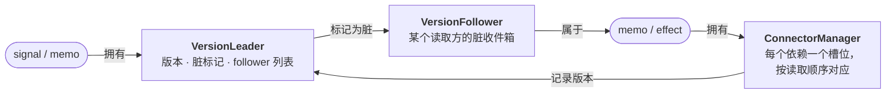
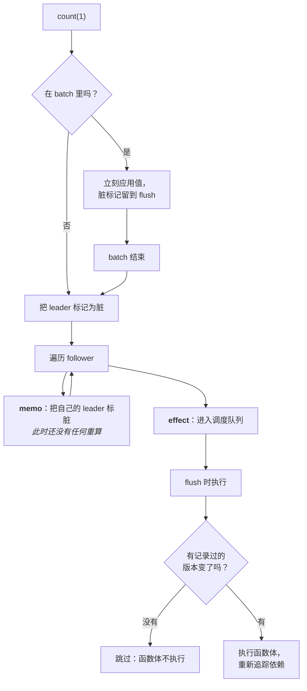

# @lenic/signal

给 TypeScript 用的 signals 引擎，小，而且全程同步。值自己知道谁在读它，下游会跟着一起保持正确，你一根线都不用接。

[](https://www.npmjs.com/package/@lenic/signal)
[](https://github.com/lenic/signal-engine/blob/main/LICENSE)
[](https://www.npmjs.com/package/@lenic/signal)

🌐 **[English](./README.md)** · **[日本語](./README.ja.md)**

> 这个项目起初只是个人练习，拿来在面试里展示能力，后来一路补下去，把该有的特性都做全了。

---

```typescript
import { signal, memo, effect } from '@lenic/signal';

const first = signal('Ada');
const last = signal('Lovelace');

const fullName = memo(() => `${first()} ${last()}`);

effect(() => console.log(fullName()));
// → "Ada Lovelace"

last('Byron');
// → "Ada Byron"
```

不用注册订阅，不用维护依赖数组，不用记得清理。在 `memo` 或 `effect` 里读一个值，这个动作本身就是订阅，剩下的交给引擎。

---

## 为什么可以选它

**公开的一致性测试套件，它一条不落地跑完了。**
[`reactive-framework-test-suite`](https://www.npmjs.com/package/reactive-framework-test-suite)
一共 179 个用例，覆盖无毛刺传播、动态依赖、批处理、销毁顺序、循环检测和错误恢复。这些恰好是各家响应式引擎真正拉开差距、又几乎没人写进文档的角落。这里 **179 / 179 全过，一个都没跳过**，另外还有 90 个自己写的测试。`pnpm test` 跑一遍就能看到。

**一切都是同步的。** 一次写入在下一行代码执行之前就已经落定，没有微任务队列，也没有「等一个 tick 才一致」这回事。测起来省事，出了问题也好查。

**没有东西能比自己的所有者活得更久。** 在 `memo` 或 `effect` 运行期间创建的一切，都属于那一次运行：嵌套的 effect、清理函数、接管过来的资源。所有者重跑或者被销毁时，它们会一层层跟着消失。

**性能不粉饰。** 传播这一侧有竞争力，创建还不行。数字全在[下面](#性能)，包括输掉的那几项。

---

## 安装

```bash
npm install @lenic/signal
pnpm add @lenic/signal
yarn add @lenic/signal
```

---

## API

四个函数，这就是全部。

### `signal(initialValue, options?)`

一个可读可写的值。不带参数调用是读，带一个参数是写。

```typescript
const count = signal(0);

count();      // → 0     （读）
count(5);     // （写）
count();      // → 5
```

写进去的值和当前值相等，就什么都不会变，也不会通知任何人。默认按 `===` 比，嫌它太严可以自己传一个比较函数：

```typescript
const deepEqual = (a: unknown, b: unknown) => JSON.stringify(a) === JSON.stringify(b);
const config = signal({ theme: 'dark' }, { comparer: deepEqual });

config({ theme: 'dark' });   // 新对象，但下游一个都不重跑
config({ theme: 'light' });  // 这次才传播
```

### `memo(fn)`

派生值。没人读就不计算，算过之后一直缓存，直到某个依赖真的变了。

```typescript
const items = signal([1, 2, 3]);

const total = memo(() => {
  console.log('summing');
  return items().reduce((a, b) => a + b, 0);
});

total();  // → 6，打印 "summing"
total();  // → 6，无输出 —— 走缓存

items([1, 2, 3, 4]);
total();  // → 10，打印 "summing"
```

memo 重算出来的值要是没变，传播就在这里停住，上游怎么折腾都不会让下游付代价：

```typescript
const n = signal(1);
const isOdd = memo(() => n() % 2 === 1);

effect(() => console.log(isOdd()));  // → true

n(3);  // n 变了，isOdd 重算了，结果仍是 true → effect 不重跑
```

如果一个 memo 不归任何所有者管，用完记得调一次 `total.dispose()`。

### `effect(fn)`

立刻执行 `fn`，把它读到的东西全都记下来，之后只要有依赖变了就再跑一次。返回的函数用来停掉它。

```typescript
const user = signal('ada');

const stop = effect(() => {
  document.title = user();
});

user('grace');   // 标题更新
stop();
user('katherine');  // 什么也不会发生
```

**首次执行永远是同步的。** 创建时、batch 里、另一个 effect 里，都一样。`effect()` 一返回，函数体就已经跑过了，依赖也已经生效。

**要清理就返回一个函数。** 它会在下一次重跑之前跑一遍，effect 销毁时再跑最后一次：

```typescript
const channel = signal('general');

effect(() => {
  const socket = connect(channel());

  return () => socket.close();
});
```

### `batch(fn)`

把多次写入合成一批，下游只会看到最后落定的结果，中间状态一个都不会漏出去。

```typescript
const width = signal(10);
const height = signal(20);

effect(() => console.log(width() * height()));  // → 200

batch(() => {
  width(30);
  height(40);
});
// → 1200，只有一次 —— 不是先 600 再 1200
```

批处理也是同步的，flush 就发生在 `batch()` 返回的那一刻，不会拖到后面某个 tick。要是这批写入自己抵消掉了（改成别的又改回来），下游一次都不会跑。

---

## 生命周期

在 `memo` 或 `effect` 运行期间创建的东西，都归那一次运行所有。

```typescript
const outer = signal(0);
const inner = signal(0);

const stop = effect(() => {
  outer();

  effect(() => console.log('inner:', inner()));
});

inner(1);   // → "inner: 1"

stop();     // 嵌套的 effect 一起消失
inner(2);   // 无输出
```

所有者只是重跑时也一样：上一次运行的子对象先销毁掉，新的运行再建出替代品。不会越积越多。

---

## 实现原理

信息只有两个流向，每个组件只服务其中一个。



向右：读取方把自己读到的每一个源的**版本**记下来。
向左：变了的源把自己的 follower 标成**脏**。

脏的意思是「过来看一眼」，不是「重算一遍」。读取方被叫醒之后，拿记下来的版本逐个和当前版本比，只有确实动过才执行函数体。所以结果没变的时候，传播就是这样被彻底挡住的。

一次写入从头到尾是这样：



### 各个组件

| | |
| --- | --- |
| `EqualComparer` | 持有值，并决定什么才算「变了」 |
| `VersionLeader` | 一个可读的源：版本号、脏标记、follower 列表 |
| `VersionFollower` | 属于某一个读取方的脏收件箱 |
| `ConnectorManager` | 读取方的依赖槽位，按读取顺序对应，所以依赖集合稳定时，每次读只要比一次身份 |
| `Schedulable` | signal 是否有待写入、effect 是否有待运行 |
| `globalScheduler` | 开批次、排空队列，并拦住失控的循环，不让它污染整个进程 |

依赖是**按位置**追踪的。读取方的槽位按读取顺序填充，所以形状不变的依赖图会原地复用它们，不分配、不记账。形状变了的时候，只重连对不上的那几个槽位；同一个源被读第二次，会折叠进第一次读已经占住的槽位。

---

## 性能

在同样的图上和三个成熟的响应式内核比了一遍。你可以自己跑：

```bash
pnpm bench
```

Node v25.8.2，每格 15 次采样取中位数，整套跑 3 轮再取中位数，单位毫秒。**越小越好。**

| 场景 | **@lenic/signal** | @preact/signals-core | alien-signals | @vue/reactivity |
| --- | --- | --- | --- | --- |
| 深链（深度 50，5k 次写入） | 25.0 | 11.2 | **4.8** | 14.4 |
| 扇出（1 个源，100 个 memo） | 18.2 | 8.2 | **4.0** | 10.7 |
| 菱形（宽度 20，5k 次写入） | 11.4 | 9.0 | **4.3** | 11.2 |
| 动态依赖（1 万次分支切换） | 5.3 | 2.4 | **1.6** | 3.6 |
| 宽依赖（100 个 signal，1 万次写入） | 18.6 | 12.9 | **11.0** | 16.3 |
| 缓存读取（100 万次） | **5.3** | 5.8 | 5.6 | 8.5 |
| 创建（2 万对 signal+memo） | 12.8 | 1.5 | **1.1** | 2.1 |
| effect 创建+销毁（2 万次） | 9.1 | 1.5 | **0.8** | 2.0 |
| 批处理（2000 批 × 10） | 5.0 | 1.2 | **0.8** | n/a |

**现在的位置**，反复读一个没变过的 memo，四家里它最快。在宽依赖集合上传播，差距在 1.7× 以内；菱形是 2.7×，动态依赖切换是 3.3×；深链和扇出落在 5× 上下。创建是短板，差了大约 12×：这里一个 signal 要占 472 字节，别人是 88 到 160 字节，因为值、版本、调度在这里是三个独立的协作者，不是同一个对象上的几个字段。

这么拆是故意的，一致性测试能跑通也靠它：引擎里十几个不出声的 bug，都是靠单独盯这几个角色才找出来的。想把创建这段差距补完，就得把它们合回一个对象，这笔账一直算不过来，创建每个 signal 只发生一次，传播会一直发生。

**几点说明**，这些都是空闲机器上的合成图。图的形状、更新频率、数据大小一变，排名就会跟着变，数字也只在同一台机器的同一次运行里可比。`pnpm bench` 在计时之前会先确认各家行为一致，再逐个场景比对校验和。少了这一步，一个悄悄少干了活的库，看起来会是最快的那个。单看某一格，跑两次能差出三分之一 —— 菱形、批处理、effect 创建+销毁尤其明显 —— 所以上面这张表是整套跑 3 轮之后取的中位数，不是单轮的结果。

---

## 状态

还在 `0.x`，内部实现在次版本之间仍会变。四个公开函数是稳定的；导出的那些机制类（`VersionLeader`、`ConnectorManager`、`globalScheduler` 之类）是留给你在上面继续搭东西的，它们会变。

---

## 许可证

[MIT](./LICENSE)
