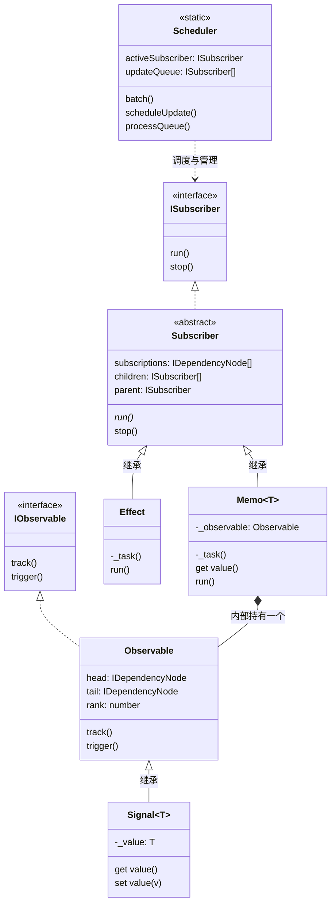

# Signal Engine OOP 架构详解

这套重构后的架构旨在将响应式引擎的核心逻辑“具象化”，让每个概念都对应一个实际的实体。整个系统的核心在于**“谁在提供数据（Observable）”**与**“谁在消费数据（Subscriber）”**，以及**“谁来调度它们（Scheduler）”**。

## 整体架构图

下面是这套架构的核心类图，展示了它们之间的继承（`|>`）和组合关联关系：

---

## 核心类的职责拆解

### 1. 基础设施与调度层
* **`Scheduler`（调度中心）**：
  * **职责**：整个系统的“大脑”和“交通警察”。
  * **作用**：维护当前的上下文（`activeSubscriber`知道当前是谁在运行），拦截多余的更新（`batch`），以及按照正确的拓扑顺序排队执行任务（`processQueue` 防止闪烁和无用渲染）。

* **`DependencyNode`（依赖节点）**：
  * **职责**：双向链表的最小单元。
  * **作用**：像一根“网线”，一头插在**消费者**身上，一头插在**数据源**身上。它将 `Subscriber` 和 `Observable` 桥接在一起。

### 2. 发布者阵营 (Data Sources)
* **`Observable`（被观察者/基础数据源）**：
  * **职责**：基础的发布者类，自带了一个双向链表。
  * **作用**：它实现了收集依赖的 `track()` 和通知更新的 `trigger()` 方法。**任何需要被订阅的数据结构，都应该继承它。**

* **`Signal`（响应式原子数据）**：
  * **职责**：最简单的数据源容器。
  * **作用**：继承了 `Observable`。当你 `get value` 时，它会调用 `track()` 告诉调度器“嘿，有人访问我了”；当你 `set value` 时，它会调用 `trigger()` 告诉调度器“我变了，快去通知订阅我的人”。

### 3. 订阅者阵营 (Consumers)
* **`Subscriber`（订阅者基类）**：
  * **职责**：基础的消费者抽象类。
  * **作用**：它身上挂着很多 `DependencyNode`（记录它到底订阅了谁），并且维护着树状关系（`parent` 和 `children`），方便在自己被销毁时，顺带把里面嵌套创建的子消费者一起干掉，防止内存泄漏。

* **`Effect`（副作用函数）**：
  * **职责**：自动运行的任务。
  * **作用**：继承自 `Subscriber`。它的 `run` 方法就是去执行你传给它的函数。在执行前，它会把自己挂到 `Scheduler.activeSubscriber` 上，这样里面任何 `Signal` 被读取时，都会顺着网线把它记录下来。

### 4. 混合体 (The Hybrid)
* **`Memo`（计算属性/派生状态）**：
  * **职责**：它既是一个**消费者**（监听别人的变化），也是一个**数据源**（可以被别人监听）。
  * **实现巧思**：在单继承的 TypeScript 中，它选择了继承 `Subscriber`（这样它可以被别人唤醒和清理），但在它**内部实例化**了一个 `Observable` 充当自己的代理。
  * **作用**：当它的上游变化时，它只是把自己标记为“脏（Dirty）”并触发内部 `Observable` 的 `trigger()`，只有当别的 `Effect` 真正去读取它的值时，它才会重新计算（这就是懒执行 Lazy Evaluation 的原理）。

---

## 一句话总结它的工作流

1. **依赖收集（Track）**：`Effect` 开始运行 -> 调度器把 `Effect` 设为当前主角 -> `Effect` 里面读取了 `Signal` -> `Signal` 被读取，把当前的主角（`Effect`）用一根“网线”（`DependencyNode`）连到自己身上。
2. **触发更新（Trigger）**：`Signal` 的值被修改 -> `Signal` 顺着网线找到所有的 `Effect` -> 把它扔给 `Scheduler` 去排队 -> `Scheduler` 把它们按照顺序重新跑一遍。
